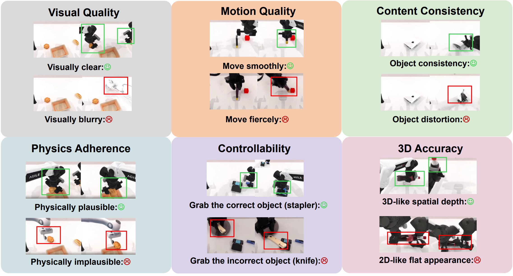
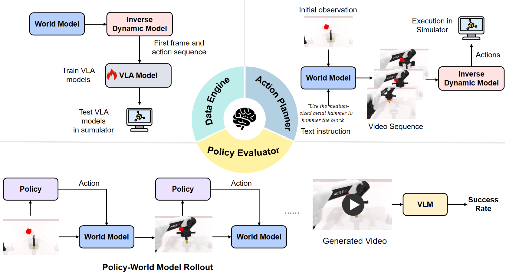

# WorldArena: A Unified Benchmark for Evaluating Perception and Functional Utility of Embodied World Models

## Table of Contents

- [Overview](#-overview)
- [Video Quality Evaluation](#-video-quality-evaluation)
- [Embodied Task Evaluation](#-embodied-task-evaluation)
- [Leaderboard](#-leaderboard)

## 🔍 Overview

WorldArena is a unified benchmark designed to systematically evaluate embodied world models across both **perceptual** and **functional** dimensions. WorldArena assesses models through **(1) video perception quality**, measured with sixteen metrics across six sub-dimensions; **(2) embodied task functionality**, which evaluates world models as synthetic data engines, policy evaluators, and action planners; **(3) human evaluations**, including overall quality, physics adherence, instruction following and head-to-head win rate. Furthermore, we propose **EWMScore**, a holistic metric integrating multi-dimensional performance into a single interpretable index. This work provides a framework for tracking progress toward truly functional world models in embodied AI.

## 🎬 Video Quality Evaluation

Please refer to [video_quality](https://github.com/worldarena/WorldArena/blob/main/video_quality/README.md) for implementation.

## 🤖 Embodied Task Evaluation

Please refer to [embodied task](https://github.com/worldarena/WorldArena/blob/main/embodied_task/Readme.md) for implementation.

## 🏆 Leaderboard

The official WorldArena leaderboard is hosted on HuggingFace: . It provides standardized evaluation results across video perception quality, embodied task functionality, and the unified EWMScore. We welcome community submissions to benchmark new embodied world models under a fair and reproducible protocol. Join us in advancing truly functional world models for embodied AI.

